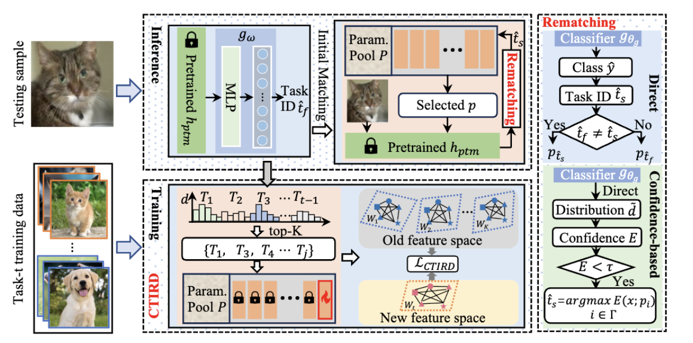

<div align="center">
<h3>Hybrid Re-matching for Continual Learning with Parameter-efficient Tuning</h3>

---

[**Weicheng Wang**]· [**Guoli Jia**]· [**Xialei Liu**]· [**Liang Lin**]· [**Jufeng Yang**]

<h3>NeurIPS 2025</h3>

## Abstract
**Continual learning seeks to enable a model to assimilate knowledge from non-stationary data streams without catastrophic forgetting. Recently, methods based on Parameter-Efficient Tuning (PET) have achieved superior performance without even storing any historical exemplars, which train much fewer specific parameters for each task upon a frozen pre-trained model, and tailored parameters are retrieved to guide predictions during inference. However, reliance solely on pre-trained features for parameter matching exacerbates the inconsistency between the training and inference phases, thereby constraining the overall performance. To address this issue, we propose HRM-PET, which makes full use of the richer downstream knowledge inherently contained in the trained parameters. Specifically, we introduce a hybrid re-matching mechanism, which benefits from the initial predicted distribution to facilitate the parameter selections. The direct re-matching addresses misclassified samples identified with correct task identity in prediction, despite incorrect initial matching. Moreover, the confidence-based re-matching is specifically designed to handle other more challenging mismatched samples that cannot be calibrated by the former. Besides, to acquire task-invariant knowledge for better matching, we integrate a cross-task instance relationship distillation module into the PET-based method. Extensive experiments conducted on four datasets under five pre-trained settings demonstrate that HRM-PET per-
forms favorably against the state-of-the-art methods. **

## Pipeline

</div>

## Requirements
- Python 3.6+  
- torch
- timm == 0.6.7

## Usage
Execute the training script in /training_script e.g. 
```
sh training_scripts/train_imr_lora_sup21k.sh
```
